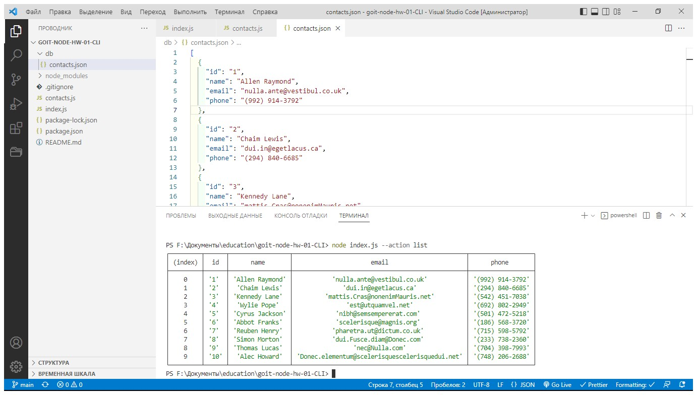
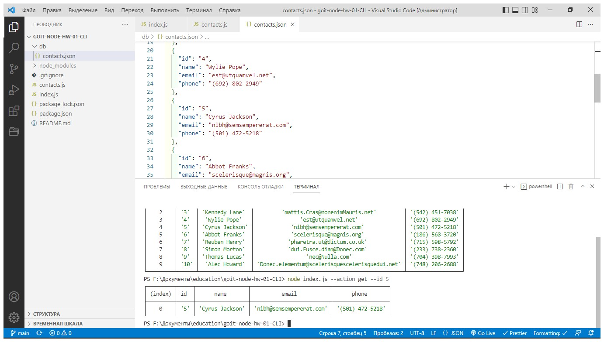
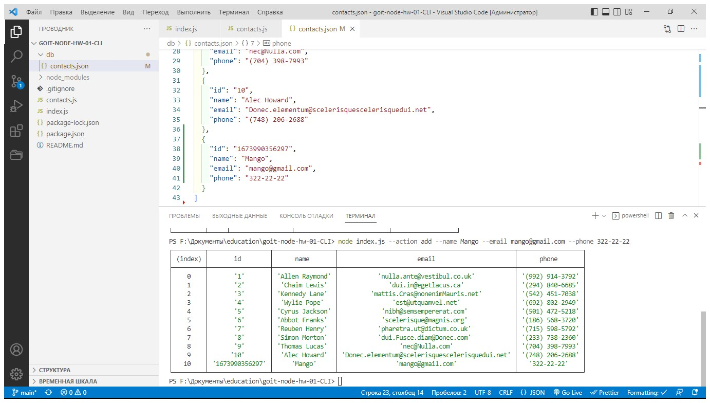
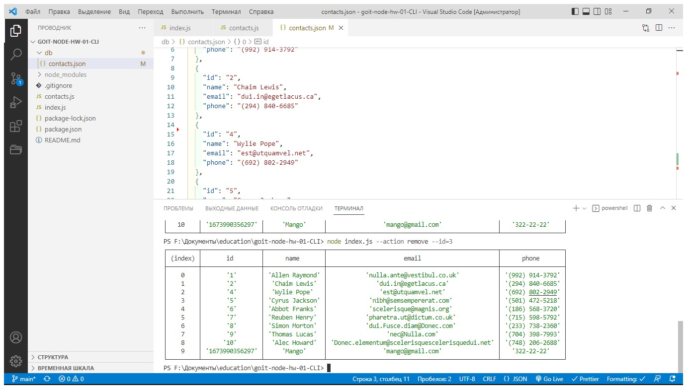

# goit-node-hw-01-CLI

# Получаем список контактов и выводим в виде таблицы (console.table)

node index.js --action="list" 

# Находим контакт по  id

node index.js --action="get" --id=5 

# Добавялем контакт

node index.js --action="add" --name="Mango" --email="mango@gmail.com" --phone="322-22-22" 

# Удаляем контакт по id

node index.js --action="remove" --id=3 